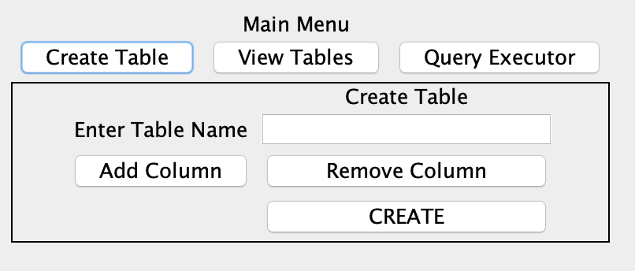
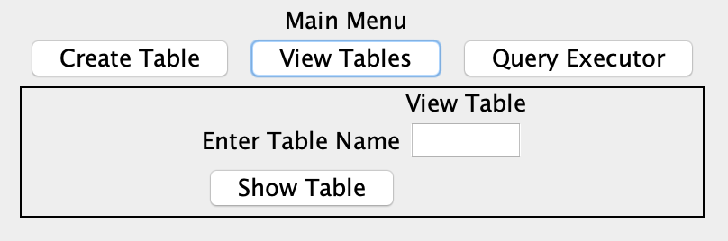
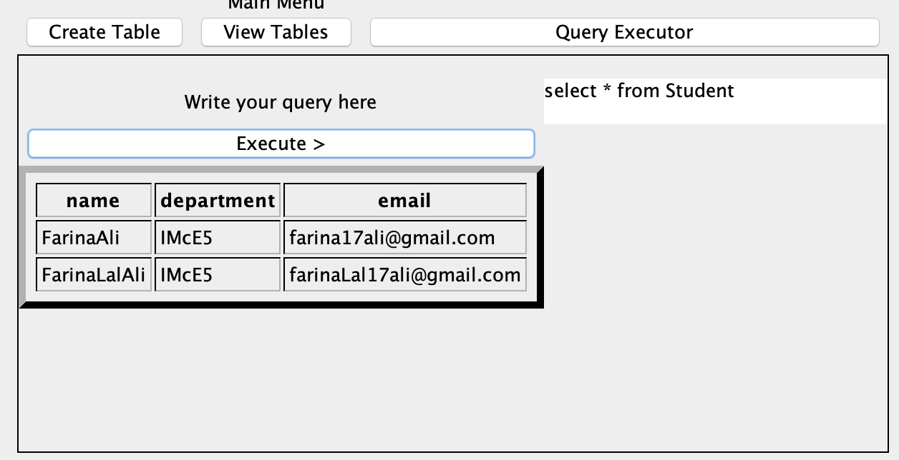

# ScalaProject
## Name. : SimpleSQLEngine
## Description :
The project is made to use the basic concepts of scala programming. We have used swing library for UI purposes. This project allows user to create table, add data to table and perform simple queries such as insert, select and delete so far. It does not support update right now.
We have used Hashmaps for keeping table name and colums data, where table name is the key. The same is for table values where we store table name as key and List[List[String]] as values.

### Create table view

We can enter table name and column names, it then creates the hashmap as described above. This hashmap can hold multiple table -> column mappings

### View Table 

### Execute Queries 

### we can execute the follwing queries
- Insert 
General insert query 

- Select 
Supported : 
Select * from tableName 
Select colms from tableName 
Not supported : "JOINS", "WHERE" and "AS"
 
- Delete 
Suppoted : Delete from tableName 
Not supported : "WHERE" clause
 
- Drop 
Drop from tableName

## Scala concepts utilized in the project
### Either | Dysjunction
We used Either to retrun Left() or Right() return depending on whether the function was successful in performing its task. 

### for loop (scala like with yield)
for(i <- list) yield {}

### Pattern matching 
 val answer=SqlMethodsClass.processQuery(query)
 - answer match {
 - case Right(x) => label.peer.setText(x)
 - case Left(x) => label.peer.setText(x.getMessage)
 - }

### Concept of singleton by using Object type class
In scala we don't have the concept of static so for the purpose of using global constants we created a Object class. 

### Concept of Abstract class and overriding it to personalize queries
Created an abstract class for query builder and used that to create queries. 

### Operations on collection classes (List , Hashmaps, Arrays)
Learned syntaxes using HashMaps, List etc, adding and removing values from them

### UI by swing library 
